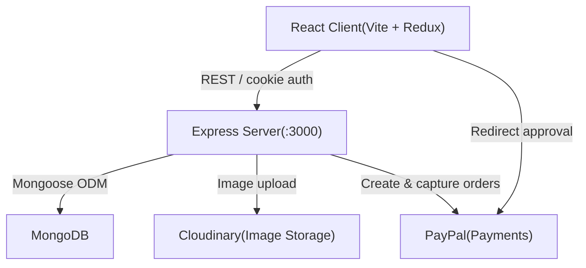
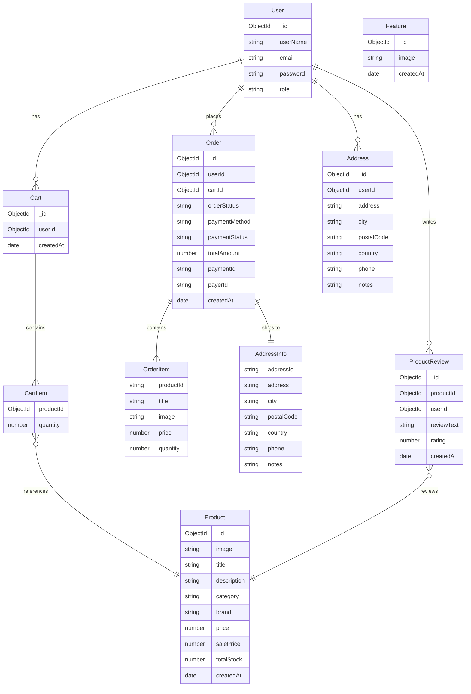
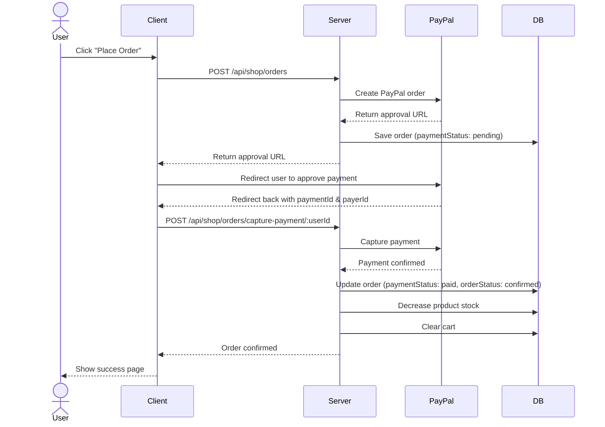

# E-Commerce Server

REST API server for the e-commerce platform, built with **Node.js**, **Express**, and **MongoDB**.

---

## Architecture



---

## Data Model (ER Diagram)



---

## Checkout Sequence



---


## Getting Started

### Prerequisites

- Node.js >= 18
- MongoDB instance (local or Atlas)
- Cloudinary account
- PayPal developer account

### Installation

```bash
npm install
```

### Environment Variables

Create a `.env` file in the root of `e-commerce-server/`:

```env
PORT=3000
MONGO_URI=mongodb://localhost:27017/e-commerce
CLIENT_URL=http://localhost:5173
JWT_SECRET=your_jwt_secret

CLOUDINARY_CLOUD_NAME=your_cloud_name
CLOUDINARY_API_KEY=your_api_key
CLOUDINARY_API_SECRET=your_api_secret

PAYPAL_CLIENT_ID=your_paypal_client_id
PAYPAL_CLIENT_SECRET=your_paypal_client_secret
```

### Running the server

```bash
# Development (with file watching)
npm run dev

# Production
npm start
```

---

## API Documentation

Interactive Swagger UI is available at:

```
http://localhost:3000/api/docs
```

---
